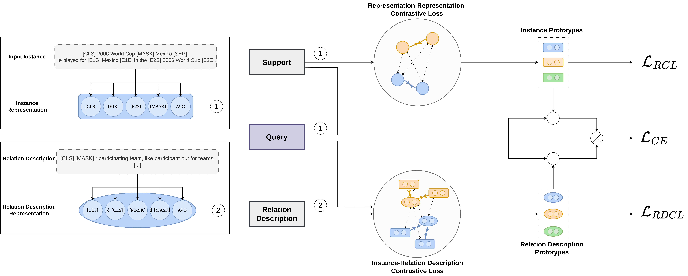

# Efficient Information Extraction in Few-Shot Relation Classification through Contrastive Representation Learning

# Abstract
Differentiating relationships between entity pairs with limited labeled instances poses a significant challenge in few-shot relation classification. Representations of textual data extract rich information spanning the domain, entities, and relations.
In this paper, we introduce a novel approach to enhance information extraction using multiple noisy representations and contrastive learning. While sentence representations in relation classification commonly combine information from entity marker tokens, we argue that substantial information within the internal model representations remains untapped. To address this, we propose aligning multiple noisy sentence representations, such as the [CLS] token, the [MASK] token used in prompting, and entity marker tokens. We employ contrastive learning to reduce the noise contained in the individual representations. We demonstrate the adaptability of our representation contrastive learning approach, showcasing its effectiveness for both sentence representations and additional data sources, such as relation description representations. Our evaluation underscores the efficacy of incorporating multiple noisy representations through contrastive learning, enhancing information extraction in settings where available data is limited.



# Run MultiRep

## Dataset
We use the FewRel dataset, which is available at https://github.com/thunlp/FewRel. Unpack the dataset into the `data/fewrel` folder.

## Training

We integrate MultiRep in the [fewshot_re_kit](https://github.com/thunlp/FewRel) and extend the `train.py` script with specific arguments for MultiRep.

- `model`: The model to train. Select "multirep" to train MultiRep.
- `remove_cls`: Remove the CLS token representation.
- `remove_mean`: Remove the mean pooling representation.
- `remove_mask`: Remove the MASK token representation.
- `remove_entitymarker`: Remove the entity marker token representations.
- `add_loss_rdcl`: Add the instance-relation description contrastive loss.
- `desc_max_length`: The maximum length of the relation description.


To train MultiRep on the FewRel dataset, run the command below or use the script `train.sh`.

```bash
# Train 5-way 1-shot
N=5
K=1
Q=5
train_iter=30000
val_iter=1000
test_iter=5000
val_step=1000
batch_size=4
grad_iter=1
model="multirep"

python train.py \
--trainN $N \
--N $N \
--K $K \
--Q $Q \
--model $model \
--batch_size $batch_size \
--grad_iter $grad_iter \
--train_iter $train_iter \
--val_iter $val_iter \
--test_iter $test_iter \
--val_step $val_step
```

# Reference
```bibtex
```

# Terms Of Use
